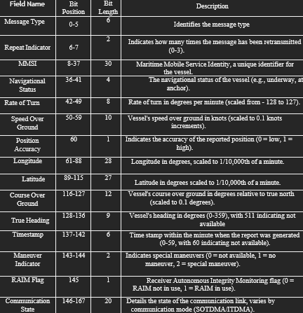
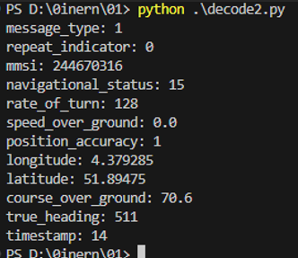
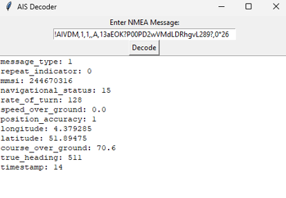
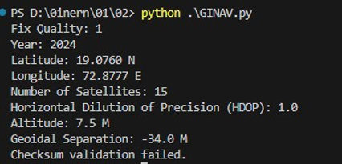
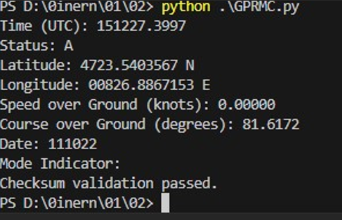

# BEL Internship – AIS & GNSS Decoding Systems

This repository contains two key modules developed as part of a project for Bharat Electronics Limited (BEL), focusing on **AIS (Automatic Identification System)** and **GNSS (Global Navigation Satellite System)** message decoding.

---

## 📁 Folder Structure

```
BEL-Internship/
├── AIS/
│ ├── decode.py # pyais decode for all AIS types (1–27)
│ ├── AIS_pyais.py # Decoding using pyais with formatted output
│ ├── AIS_Manual.py # Manual decoding for AIS types 1, 2, 3
│ ├── Decode_type-1,2,3.py # Alternate manual decoding for types 1, 2, 3
│ └── Decode_GUI.py # GUI decoder for Types 1, 2, 3
│
├── GNSS/
│ ├── GINAV.py # Custom GINAV sentence parser
│ ├── GPRMC.py # Standard GPRMC parser with checksum validation
│ ├── GNSS_Sender.py # UDP sender for GNSS messages
│ └── GNSS_Receiver.py # UDP receiver for GNSS messages
│
├── Images/
│ ├── ais_output1.png # Terminal output of decode.py
│ ├── gui_window.png # AIS GUI screenshot
│ ├── msg_type_table.png # AIS Message Type Bit Table
│ ├── gnss_output_ginav.png # Output from GINAV.py
│ ├── gnss_output_gprmc.png # Output from GPRMC.py
│
└── README.md
```
---

## 🚢 AIS Decoding Overview

AIS messages are used by vessels to broadcast identity, position, speed, course, and other data. This project supports multiple decoding approaches:

### AIS Decoders:

- `decode.py`: Decodes all AIS message types (1–27) using `pyais`.
- `AIS_pyais.py`: Extracts specific AIS fields using `pyais` and prints them as dictionaries.
- `AIS_Manual.py`: Manual decoding of message types 1, 2, 3 using binary slicing.
- `Decode_type-1,2,3.py`: Alternate manual decoding for AIS types 1, 2, 3.
- `Decode_GUI.py`: GUI decoder (Tkinter) for Types 1, 2, 3.

---

## 📊 AIS Message Type 1/2/3 Bit Table

This table shows the bit-wise structure of AIS messages types 1, 2, and 3:



---

## 🖼 AIS Output Samples

- **Terminal Output (decode.py):**  
  

- **GUI Output (Decode_GUI.py):**  
  

---

## 🛰 GNSS Decoding Overview

GNSS parsing includes both custom ($GINAV) and standard ($GPRMC) NMEA sentence decoding. It extracts data such as UTC time, position, altitude, and satellite info.

### GNSS Scripts:

- `GINAV.py`: Parses custom `$GINAV` sentences and validates checksum.
- `GPRMC.py`: Parses `$GPRMC` standard sentences with checksum verification.
- `GNSS_Sender.py` & `GNSS_Receiver.py`: Send and receive GNSS data using UDP sockets.

---

## 🖼 GNSS Output Samples

- **GINAV Output:**  
  

- **GPRMC Output:**  
  

---

## ▶️ How to Run

```
# Run AIS Decoders
python AIS/decode.py
python AIS/AIS_pyais.py
python AIS/AIS_Manual.py
python AIS/Decode_type-1,2,3.py
python AIS/Decode_GUI.py  # GUI

# Run GNSS Parsers
python GNSS/GINAV.py
python GNSS/GPRMC.py
python GNSS/GNSS_Sender.py
python GNSS/GNSS_Receiver.py
```

### Requirements

```
pip install pyais
```
